# Document Purpose

This document describes the implemented WBTE workflow from academic setup through evaluation, monitoring, and reporting. It identifies which role performs each action, how records move through the system, and which controls protect student identity and confidential data.

**Revision status:** The Department Head role and its school-wide, aggregate-only access boundary are represented in all 13 flowcharts in this document.

## Roles

| Role | Primary responsibility | Account workflow |
|---|---|---|
| Administrator | Configures academic data, periods, assignments, users, announcements, analytics, backups, and audit logs | Existing administrator account; administrator accounts cannot be deleted inside WBTE |
| Student | Registers, views assigned teachers, submits one evaluation per teacher and period, and reviews completion history | Self-registration; account becomes active and signs in automatically |
| Department Head | Reviews school-wide aggregate results, responsive charts, grouped comment themes, and exports without raw comments | Account created by an administrator; email verification is required; no department assignment |
| HR | Monitors school-wide teachers, reviews released results and anonymous comments, and exports detailed reports | Account created by an administrator; email verification is required; no department assignment |
| Teacher | Subject of an evaluation and owner of the department, subject, program, year-level, and section scope used for matching | Data record only; teachers do not sign in |

## Organizational Scope

- Teachers are assigned to departments because evaluation results must be grouped by the teacher's academic department.
- Students inherit a department through their selected program and retain program, year-level, and section data for assignment matching.
- Administrators, HR, and Department Heads are school-wide roles and are not assigned to a department.
- HR receives detailed released anonymous results. Department Heads receive only privacy-protected aggregates and grouped themes.

# 1. Overall System Flow

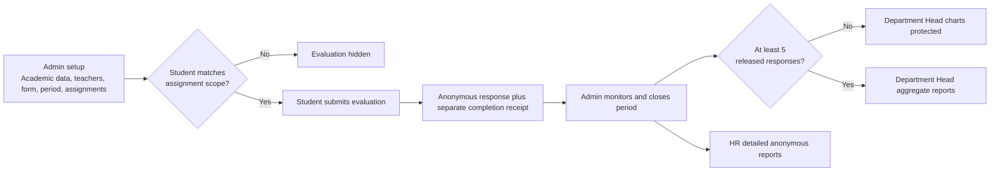

**Core rule:** an evaluation is visible only when the period is available and the student's account ID is included in the assignment after academic-scope matching.

# 2. Administrator Setup and Evaluation Lifecycle

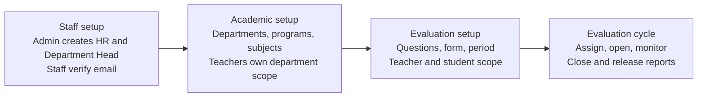

## Administrator CRUD Rules

- Departments, programs, subjects, questions, forms, periods, teachers, and assignments support administrative management.
- Teacher edits synchronize non-closed assignments with the latest program, year-level, section, subject, and status scope.
- Existing assignments can be edited to change their selected students.
- A teacher with evaluation history should be marked inactive instead of deleted.
- An assignment with submissions cannot be deleted.
- Closed periods and completed student links are preserved for reporting and history.
- Administrator, HR, and Department Head staff accounts do not receive an assigned department.
- Administrator accounts cannot be deleted from the WBTE user-management interface.

# 3. Account Registration and Authentication

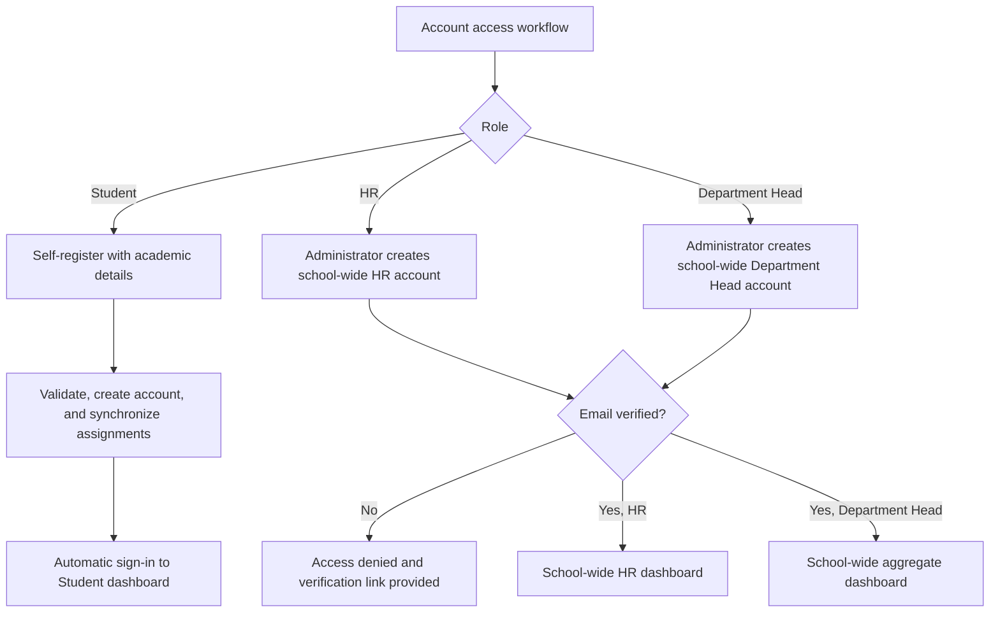

**Authentication behavior:** student email verification is not required. HR and Department Head email verification is required. Disabled accounts are denied access, and route guards redirect each authenticated user to the dashboard for their role.

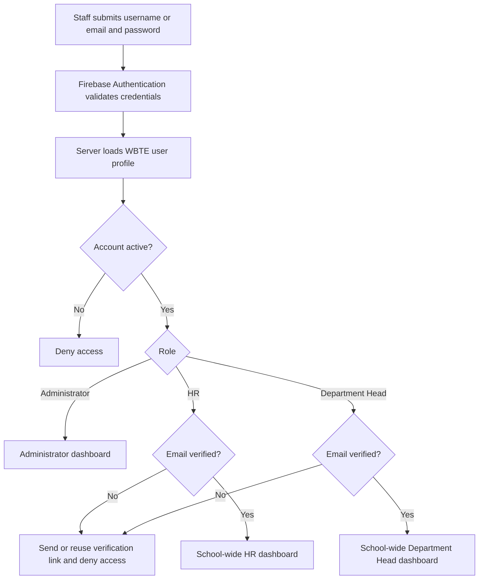

# 4. Assignment Visibility Decision

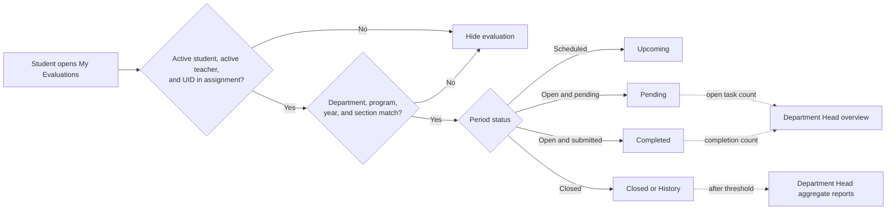

## Section Matching

- Leaving **Assigned sections** empty includes every section within the selected programs and year levels.
- Entering `A, B, C` includes only those sections.
- Section comparison is case-insensitive.
- Newly registered eligible students are synchronized into existing open or scheduled assignments automatically.

## Assignment Count Meaning

An assignment record connects one teacher, subject, evaluation period, and a set of eligible students. Dashboard **Open evaluation tasks** count each student-to-teacher obligation, not only the number of assignment documents.

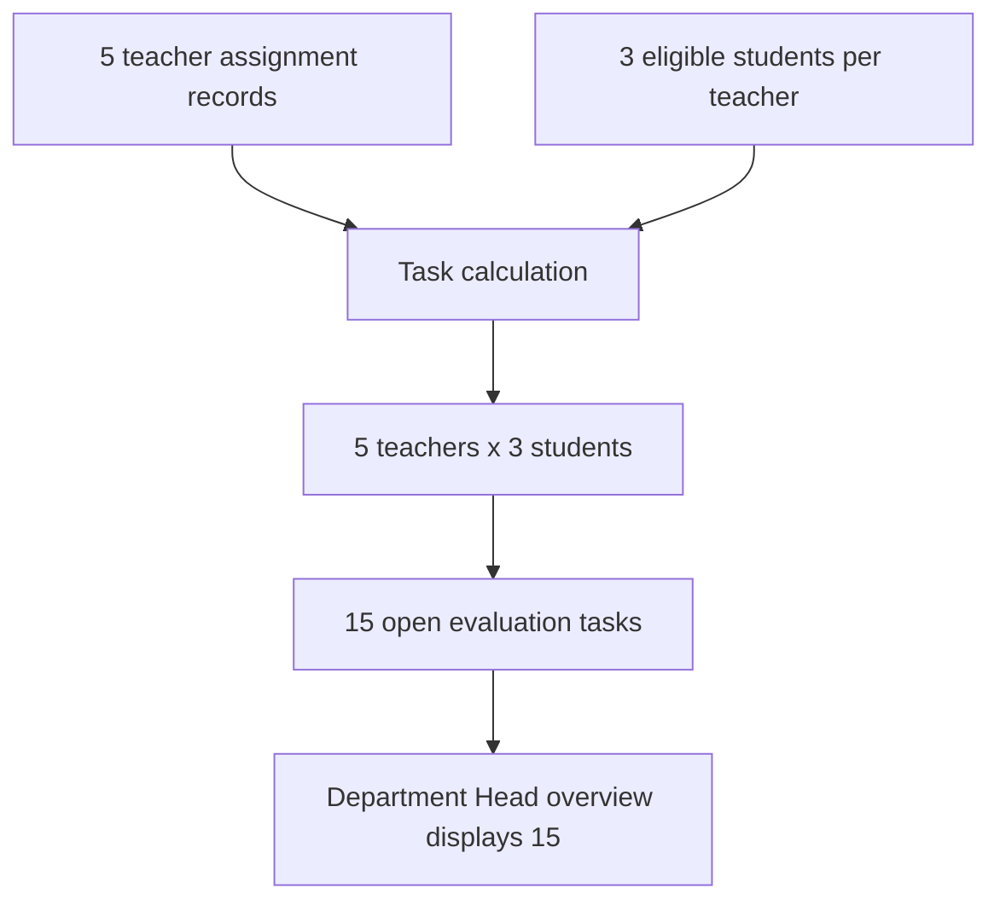

Each assigned student therefore sees one pending evaluation for each included teacher. Completing one teacher evaluation removes one task from the pending total.

# 5. Student Evaluation Submission and Anonymity

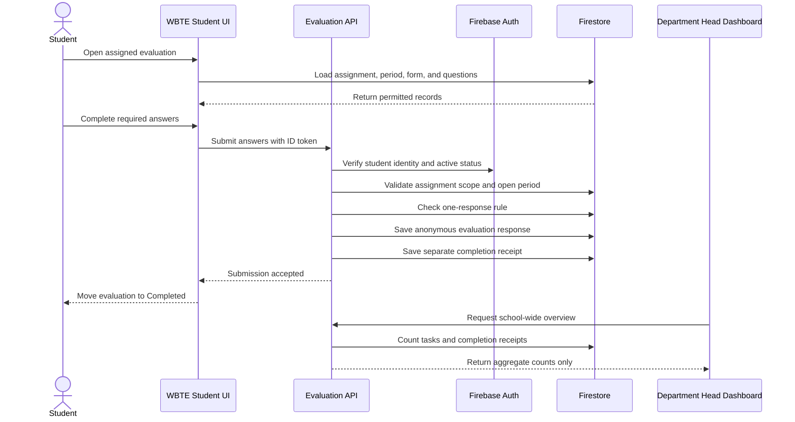

## Privacy Controls

- Evaluation response documents do not contain the student's identity.
- Completion receipts retain identity separately so WBTE can prevent duplicate submissions and calculate progress.
- HR sees released anonymous comments school-wide.
- Department Heads receive only grouped themes and counts; raw comments are not sent to their browser.
- Rating and comment results are protected until the evaluation period closes.
- Department Head charts additionally require at least five submitted responses in the selected released view. Five closed periods do not satisfy this rule unless those periods contain at least five released responses in total.

# 6. HR and Department Head Reporting Boundaries

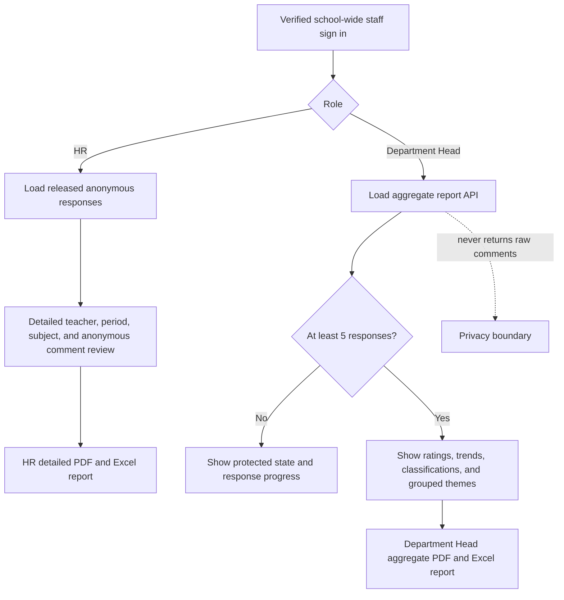

## Reporting Data Boundary

HR can review school-wide released anonymous responses and detailed reports. Department Heads can review school-wide aggregate metrics, grouped comment themes, and counts through a protected server API, but cannot read raw evaluation or report documents.

# 7. Department Head Overview and Reporting

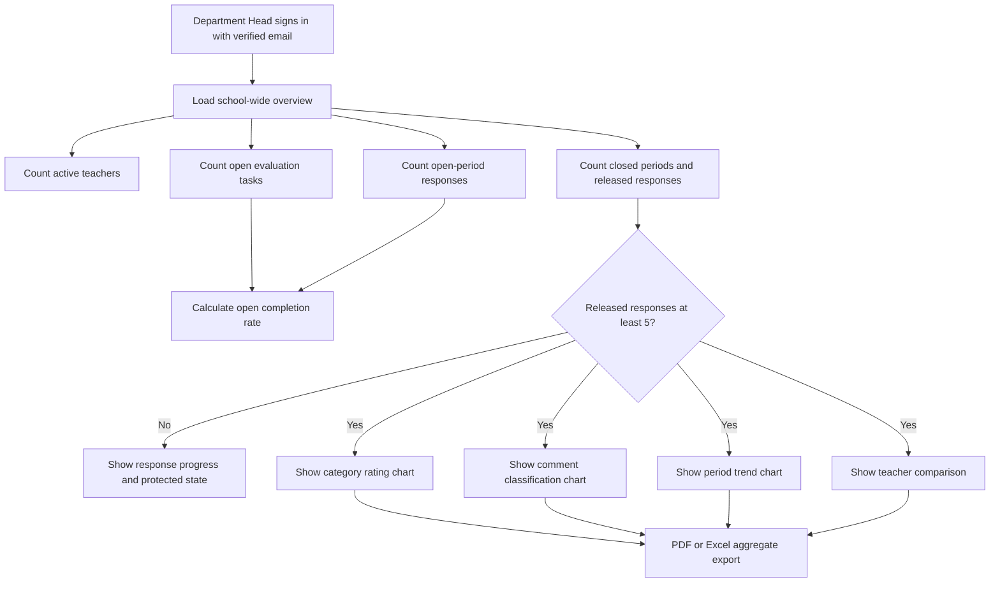

## Dashboard Metric Definitions

| Metric | Meaning |
|---|---|
| Active teachers | Teacher records not marked inactive |
| Open evaluation tasks | Unique student-to-teacher obligations belonging to currently open periods |
| Open-period responses | Completed tasks that belong to currently open periods |
| Open completion rate | Open-period responses divided by open evaluation tasks |
| Closed periods | Evaluation periods whose status is closed |
| Released responses | Anonymous evaluation responses belonging to closed periods |
| Released average | Average of released ratings, shown only when the five-response privacy threshold is met |

The five-response threshold counts submitted anonymous responses, not periods, teachers, assignment records, or selected sections.

# 8. Announcement and Email Delivery

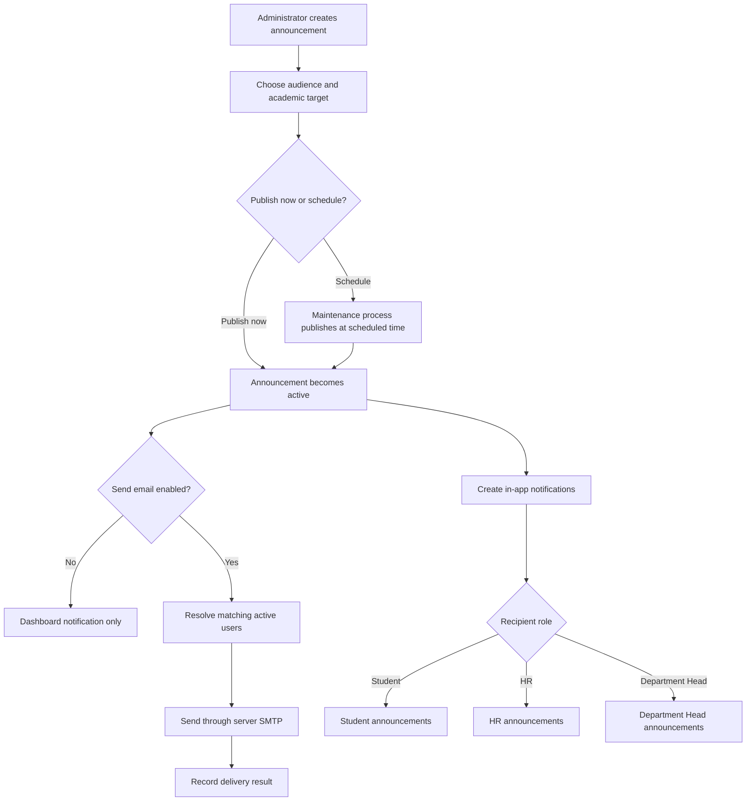

**SMTP boundary:** announcement and workflow email uses the SMTP values in the root server environment. Firebase Authentication SMTP settings apply only to Firebase Authentication templates.

# 9. Data and Security Architecture

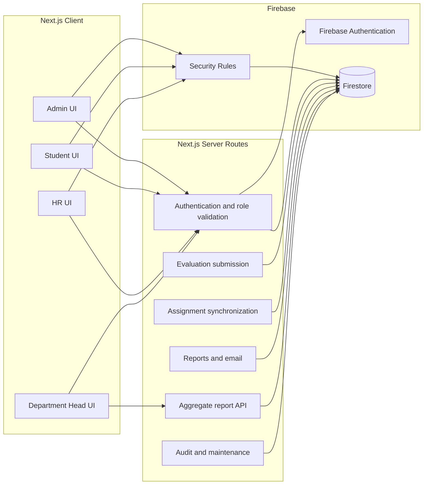

## Primary Collections

| Collection | Purpose | Main access |
|---|---|---|
| `users` | Role, status, profile, and student academic scope | Self and administrator, with server-side role controls |
| `studentRegistry` | Student registration source and account link | Server only |
| `departments`, `programs`, `subjects` | Academic structure | Role-filtered read; administrator write |
| `teachers` | Teacher records and teaching scope | Role-filtered read; administrator write |
| `evaluationQuestions`, `evaluationForms` | Question bank and reusable forms | Active users read; administrator write |
| `evaluationPeriods` | Schedule, form, and release state | Active users read; administrator write |
| `teacherAssignments` | Teacher, subject, period, scope, and student UID list | Assigned student or administrator |
| `evaluations` | Anonymous answers and scores | Administrator; HR after release |
| `evaluationCompletions` | Identity-bearing completion receipt | Owning student or administrator |
| `announcements`, `notifications` | Targeted notices and delivery state | Server-filtered or owning user |
| `performanceReports` | Generated closed-period summaries | Administrator and verified HR |
| `activityLogs`, `systemBackups` | Auditability and recovery | Administrator or server only |

# 10. Recommended Operating Sequence

1. Configure departments and active programs.
2. Add subjects under the correct department.
3. Add teachers and select their subjects, programs, year levels, and sections.
4. Create active questions and assemble an active evaluation form.
5. Create a period, attach the form, and confirm its dates.
6. Create individual or bulk teacher assignments.
7. Open the period and confirm that matching students see Pending evaluations.
8. Monitor completion without exposing response identity.
9. Close the period to release anonymous responses to authorized HR.
10. Confirm that a released report view has at least five submitted responses before expecting Department Head charts.
11. Generate PDF or Excel reports and retain audit and backup records.

# 11. Troubleshooting Path

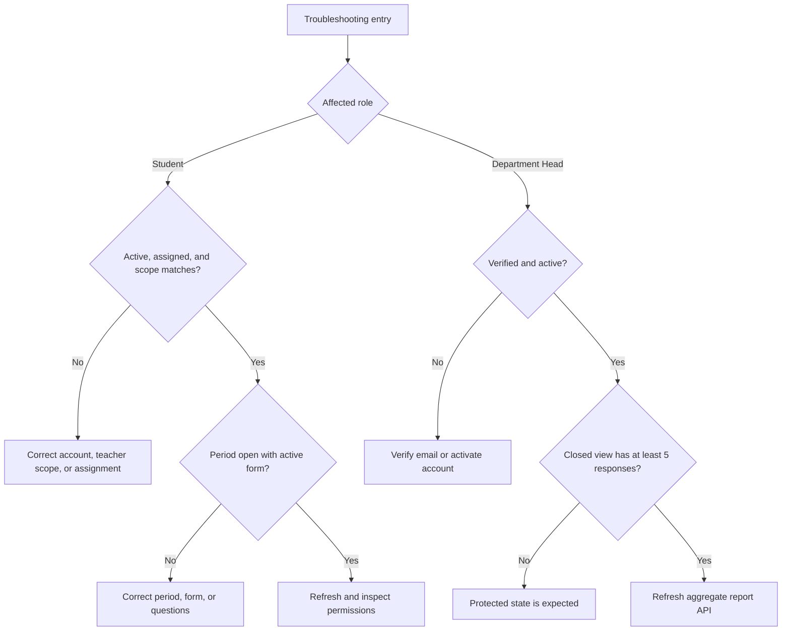

## Protected Department Head Charts

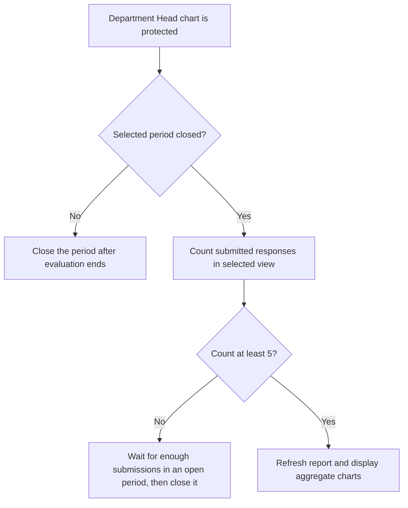

---

**Document control:** This workflow reflects the WBTE implementation as reviewed on September 12, 2026.
